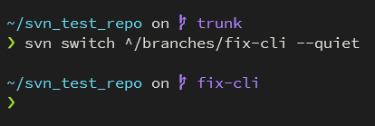

# starship-svn
SVN support for [starship.rs](starship.rs) via a custom commands.



## How does it work
`starship-svn` runs and parses the `svn info` of the working directory.

SVN only has a branch name by convention. The name is derived from the `svn info` URL. This is done
with the assumption that the repo uses the conventional trunk/branches/tags repository layout. If
the URL path contains a folder named 'trunk', the branch name is trunk. If the URL path contains a
folder named 'branches' or 'tags' the next folder is considered the branch name, if it is not
blacklisted.

If your branch named folder is not a direct child of 'branches' or 'tags' the inbetween folders can be blacklisted.
The algorithm continues to scans right for a branch name until a non blacklisted folder name is found.


## Install
`starship-svn` uses `svn` CLI so make sure it is installed. This can be checked with `svn --version`.

Install `starship-svn`
```
cargo install --git https://github.com/IsaacDynamo/starship-svn
```

## Config
Add the following to your `starship.toml`.

```
[custom.svn]
description = 'SVN branch name'
command     = 'starship-svn'
when        = 'starship-svn'
format      = 'on [$symbol$output]($style) '
symbol      = ' '
style       = 'bold purple'
```
